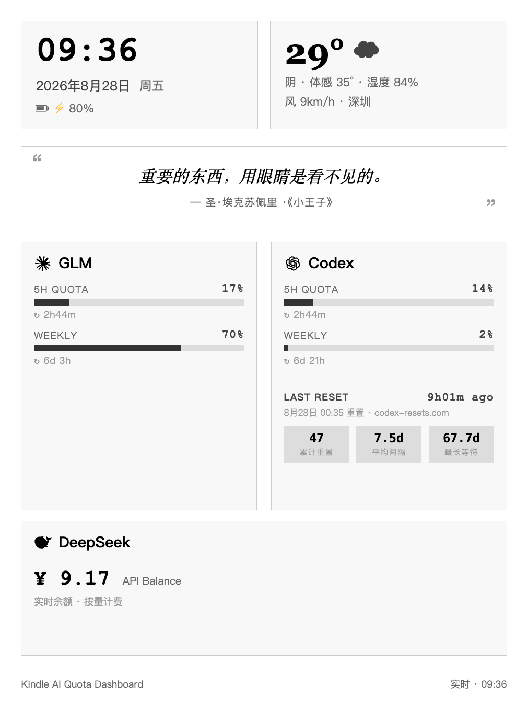

# Kindle AI 额度中控台

把吃灰的墨水屏（Kindle / 汉王等）变成 AI 额度监控屏。实时显示 Codex、GLM、DeepSeek 的用量，外加天气、每日一语和官方额度重置动态。

**不需要同一个 WiFi。** 电脑和 Kindle 可以在不同的网络——数据通过 GitHub Pages 中转，只要两边都能上网就行。这是和 GitHub 上其他类似项目最大的区别：它们大多要求电脑和显示设备在同一个局域网里。



---

## 它能做什么？

- **跨网络实时同步**——电脑在公司、Kindle 在家，额度照样更新
- 实时监控多个 AI 平台的额度用量（内置 Codex / GLM(智谱) / DeepSeek / Claude / Kimi 采集器，可自行增减）
- 显示 OpenAI 官方最新一次 Codex 额度重置时间与历史统计（数据来自 [codex-resets.com](https://codex-resets.com/)）
- 在墨水屏上全屏显示，放桌上一眼就能看到谁快没额度了
- 自带天气显示、电池电量、每日一语
- 亮屏保活：Wake Lock + 静音视频双层机制，降低定制安卓墨水屏（如汉王）自动息屏的概率
- 夜间自动省电（03:00–08:00 停止刷新）
- 局部 DOM 更新，不整页刷新，减少墨水屏闪烁
- 隐私优先——所有 API 密钥和令牌只留在你的电脑上，不会进入 Git

## 我需要什么？

- 一台 Kindle（越狱后体验最佳，也可以用自带浏览器先试试效果）
- 一台常开的电脑（Windows / Mac / Linux，用来采集额度数据）
- 一个 GitHub 账号（用于 GitHub Pages 数据中转）
- 至少一个 AI Agent（Claude Code 或 Codex）来帮你完成配置

> 为什么需要 Agent？因为你既然用这个中控台来监控 AI 额度，说明你已经在用 AI 了。让它帮你配环境、改代码，比你自己照着文档折腾快十倍。

## 怎么用？

**这个项目的设计理念是：你负责动手，Agent 负责动脑。**

### 第一步：Fork 仓库

点右上角的 Fork，把这个仓库复制到你的 GitHub 账号下。

### 第二步：把仓库交给你的 Agent

把仓库地址丢给你的 Claude Code 或 Codex，告诉它：

> "我想用 Kindle 做一个 AI 额度中控台。这是开源项目的仓库，帮我看看怎么在我的电脑上跑起来。我用的 AI 平台是 ____（列出你在用的），我的 Kindle 型号是 ____，我的电脑是 Windows / Mac。"

Agent 会阅读仓库里的代码和文档，然后告诉你：
- 需要你提供哪些 API 凭证
- 如何在你的电脑上设置采集脚本
- 如何配置 GitHub Pages 作为数据中转

### 第三步：越狱 Kindle

这一步需要你亲自操作（Agent 可以指导你，但按钮得你按）。

推荐方案是 [WinterBreak](https://kindlemodding.org/jailbreaking/WinterBreak/)，具体操作流程让你的 Agent 根据你的 Kindle 型号和固件版本来指导。核心要点：

1. **先开飞行模式**，防止固件自动升级
2. 按照越狱指南操作
3. 安装 KUAL + KOReader

越狱完成后，你的 Agent 可以通过 KOReader 的 SSH 功能把中控台部署到 Kindle 上。

> 不想越狱？也可以用 Kindle 自带的「体验版浏览器」打开 GitHub Pages 链接来查看，只是不能全屏、会自动息屏。

### 第四步：告诉 Agent 你的偏好

- 你想监控哪几家 AI 的额度？（只用 Claude 一家也行）
- 每日一语想要什么风格？（古诗词 / 外国文学 / 励志 / 随机）
- 前端想不想自己改？（颜色、布局、卡片顺序等都可以 DIY）

Agent 会帮你配好一切。配好之后，Kindle 上就是全屏仪表盘，放桌上当额度监控屏。

---

## 先看看效果（不需要 Kindle）

需要 Node.js 18+，不需要安装第三方依赖：

```bash
git clone https://github.com/softmutiny/kindle-ai-quota-dashboard.git
cd kindle-ai-quota-dashboard
npm run demo
npm run build
npm run serve
```

浏览器打开 `http://127.0.0.1:8787`，看到的是假数据演示——不会读取任何真实账户信息。

---

## 架构简述

```
你的电脑（采集器）                     Kindle（越狱 + 全屏 Chromium）
  │                                      │
  ├─ 定时采集各 AI 平台额度（示例 5 分钟）  ├─ 每 3 分钟从 GitHub Pages 拉数据
  ├─ 生成 data.js / data.json            ├─ 局部 DOM 更新（不闪屏）
  └─ 每轮采集后推送到 GitHub Pages        └─ 03:00–08:00 夜间省电
                    │                      │
                    └──── GitHub Pages ─────┘
                        （数据中转站）
```

电脑和 Kindle **不需要在同一个网络**。数据通过 GitHub Pages 中转——电脑 push 上去，Kindle 从公网拉取。受 Pages CDN 约 10 分钟缓存影响，数据从采集到上屏通常在 5–15 分钟内。

## 接入真实数据

1. 复制配置模板：`config.example.json` → `config.json`
2. 只开启你需要的数据源
3. API 密钥放在环境变量里，不要写进配置文件
4. 运行 `npm run collect` + `npm run build`

每个数据源默认都是关闭的，你只开你用的：

| 数据源 | 数据来源 | 说明 |
|--------|---------|------|
| Codex | 本机 Codex CLI | 需要在配置中显式开启 |
| GLM | 智谱开放平台监控接口 | 需要在配置中显式开启，密钥可放环境变量或本地文件 |
| Kimi | 本机 Kimi Code 登录凭证 | 只读，不会刷新你的令牌 |
| DeepSeek | 环境变量或本地密钥文件中的 API Key | 按量计费，显示实时余额 |
| Codex Resets | codex-resets.com 公开页面 | 免密钥，自动抓取最新官方重置时间与统计 |

除 Codex Resets 外，每个采集器读取本机密钥前都要求配置里同时写明 `experimental: true` 和 `allowLocalCredentialRead: true`，否则宁可显示"未启用"也不会碰你的凭证文件。

**密钥安全**：`config.json` 与 `config/*.key` 均被 gitignore 覆盖，永远不会进入 Git。密钥支持两种放置方式：环境变量（`apiKeyEnv`）或本地文件（`credentialsFile`，例如从 CCSwitch 等工具导出）。

## 天气

内置 [Open-Meteo](https://open-meteo.com/) 采集器（免费无密钥），城市与坐标在 `scripts/fetch-weather.cjs` 顶部改两个常量即可。部署脚本每次运行会先刷新天气，失败不阻塞额度发布。

## 定时采集

`npm run deploy` 一条命令完成：抓天气 → 采集全部数据源 → 构建 → 推送 gh-pages → 触发 Pages 构建。macOS 上建议用 launchd 定时跑（plist 放在 `~/Library/LaunchAgents/`，用 `StartInterval` 控制间隔），Windows 用任务计划程序，Linux 用 cron。注意 launchd / cron 环境没有你的 shell 配置，代理（HTTP_PROXY 等）、PATH 和可执行文件路径需要显式写进任务环境。

## 墨水屏适配经验

- **整页单文件**：构建时把数据、渲染脚本、保活脚本全部内嵌进 `index.html`，规避部分定制浏览器按文件路径缓存 JS 且无视版本参数的问题（症状：页面停在"等待实时数据"占位状态）
- **亮屏保活**：`web/keep-awake.js` 优先申请 Wake Lock，兜底循环播放 1.5KB 的静音黑屏视频；若系统仍息屏，请在系统设置里把休眠时间调到最长
- **弱网友好**：整页一个请求，数据 31KB 左右

详见 [系统架构](docs/architecture.md)。

## 每日一语

`examples/quote.example.json` 是模板，复制到 `config/` 后可以：

- 让你的 Agent 每天自动选一句推送（我们就是这么干的）
- 自己手动改
- 写一个定时脚本调用任意 AI 生成

示例提示词（给你的 Agent 或者写进定时任务）：

> "从中国古诗词或世界文学经典中选一句适合今天心境的话，要求简短、有意境。只输出原文和出处，不要解释。"

你也可以把这段提示词改成你喜欢的风格——二次元台词、电影金句、毒鸡汤，随你。

## DIY 前端

前端是纯 HTML + CSS + JS，没有框架依赖，随便改。

| 文件 | 用途 |
|------|------|
| `web/index.html` | 主页面 |
| `web/dashboard-runtime.js` | 数据拉取和渲染逻辑 |
| `web/keep-awake.js` | 亮屏保活 |

想改颜色和字体？直接改 CSS。想加一个新的 AI 平台？在 `src/collectors/` 里加一个采集器，Agent 会帮你搞定。

改完之后运行 `npm run build` 重新构建，然后让 Agent 同步到 Kindle。

## 跨平台说明

采集脚本是 Node.js 写的，Windows / Mac / Linux 都能跑。不同平台有一些小差异（凭证路径、定时任务方式、SSH 工具），但这些你的 Agent 都能处理——告诉它你的操作系统就行。

## 常见问题

**Q: 必须越狱才能用吗？**
作为全屏 APP 需要越狱。但你也可以先用 Kindle 自带的「体验版浏览器」打开 GitHub Pages 链接来看看效果，只是不能全屏、会自动息屏。

**Q: 会不会把 Kindle 搞坏？**
越狱本身有极小概率的风险，但只要按官方指南操作、不跳步骤，基本不会出问题。中控台本身不修改 Kindle 系统文件。

**Q: 额度数据是公开的吗？**
如果使用 GitHub Pages 托管，数据是公开可访问的（别人能看到你各平台的额度百分比）。如果你介意，可以用私有仓库 + 自建服务替代。数据里**不包含任何 API 密钥或登录凭证**——采集脚本会自动过滤掉敏感信息。部署前建议阅读 [隐私说明](docs/privacy.md)。

**Q: 墨水屏费电吗？**
静态画面本身几乎不耗电（墨水屏只在刷新时用电）。开启亮屏保活后，主要代价是系统不再深度休眠，耗电会明显高于纯待机；打算长期当中控台用建议插电。页面自带夜间省电，03:00–08:00 停止数据刷新。

**Q: 页面一直显示"等待实时数据"？**
多半是墨水屏浏览器缓存了旧脚本。新版构建已把所有脚本内嵌进单个 HTML 文件规避此问题；若仍出现，请强制刷新或清除该页缓存。

**Q: 我只用 Claude 一家，也能用吗？**
能。在 `config.json` 里只开启 Claude 就行，前端会自动适配。

**Q: 天气需要单独买 API 吗？**
不需要。可以用免费的公共天气 API，Agent 会帮你配好。

## 更多文档

- [系统架构](docs/architecture.md)
- [隐私说明](docs/privacy.md)
- [Kindle 兼容性与恢复](docs/compatibility.md)
- [故障排查](docs/troubleshooting.md)
- [安全说明](SECURITY.md)
- [参与贡献](CONTRIBUTING.md)

## 许可证

[MIT License](LICENSE)

---

*这个项目最初是为了解决一个很朴素的需求：家里的 AI 太多了，每次查额度都得一个一个登进去看。不如让 Kindle 替我盯着，放在桌上一眼就知道。*

*由社区贡献者共同维护。*
